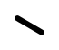
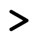
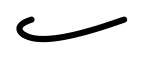
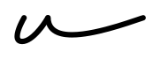

# User Guide

## Applications

After installing Grascii, it is available for use by programs on your system.
Note that Grascii uses advanced OpenType features which are not well-supported
by all applications. For best results, try applications that use the
[HarfBuzz](https://en.wikipedia.org/wiki/HarfBuzz) text shaper under-the-hood.

## Language

With the font, Gregg shorthand forms are written using a version of the [Grascii
Language](https://grascii.readthedocs.io/en/stable/language.html). To begin,
read the linked language documentation.

### Unimplemented Language Features

The following Grascii language features are not currently supported by the font:

- `X` and `XS` strokes. These are shaped as `S` and `SS` respectively.
- Uncommon sound annotations: `.` and `,`
- Reversed vowels: `~`
- Loop vowels: `|`
- Sideways `U`: `U)`
- Disjoiners: `^`

### Case-insensitivity

The font is case-insensitive. It does not matter whether you use uppercase or
lowercase letters. You will get the same result.

### Punctuation

The font supports the following basic punctuation:

| Name | Character | Glyph |
|-|:-:|:-:|
| period | `.` |  |
| question mark | `?` |  |
| paragraph | `>` |  |

## Sizing

Grascii's glyphs are sized such that the widest glyphs (like Gregg L) are as
wide as the widest glyphs in a typical Latin font (like Latin M). As such, at
12pt, Grascii appears very small. The font size at which Grascii approaches the
actual size of handwritten Gregg Shorthand is 36-48pt.

## Spacing

A space advances the cursor from the rightmost edge of the previous glyph. While
this behavior works well in most cases, it can fall short when strokes that end
to the left of where they began (like Gregg B) are involved.

"B" followed by a space is no problem: the cursor advances from the rightmost
edge of the "B", the top. However, "BE" followed by a space has an issue. The
cursor advances from the rightmost edge of the "E" which is not as far right as
the top of the "B". Thus, the cursor may land left of the top of the "B" or
close to it causing the next typed stroke to overlap with the "B"!

Rather than implementing an expensive system in the font to correct this behavior,
Grascii leaves it up to the user to insert additional spaces as needed in these
cases.

## Styling

Like the Grascii language, the Grascii font is based on the Preanniversary
(1916) edition of Gregg Shorthand. Vowel joinings are modeled after that
version.

The font does not have built-in support for other editions of Gregg Shorthand
yet, but in the meantime most stylistic differences can be achieved using
boundaries ("-"). A boundary causes adjacent strokes to be shaped as if they
were not next to each other. For example, "OR" in Preanniversary looks like:

However, from Diamond Jubilee Series the "O" is not placed its side. A boundary
produces the desired effect as in "O-R":

